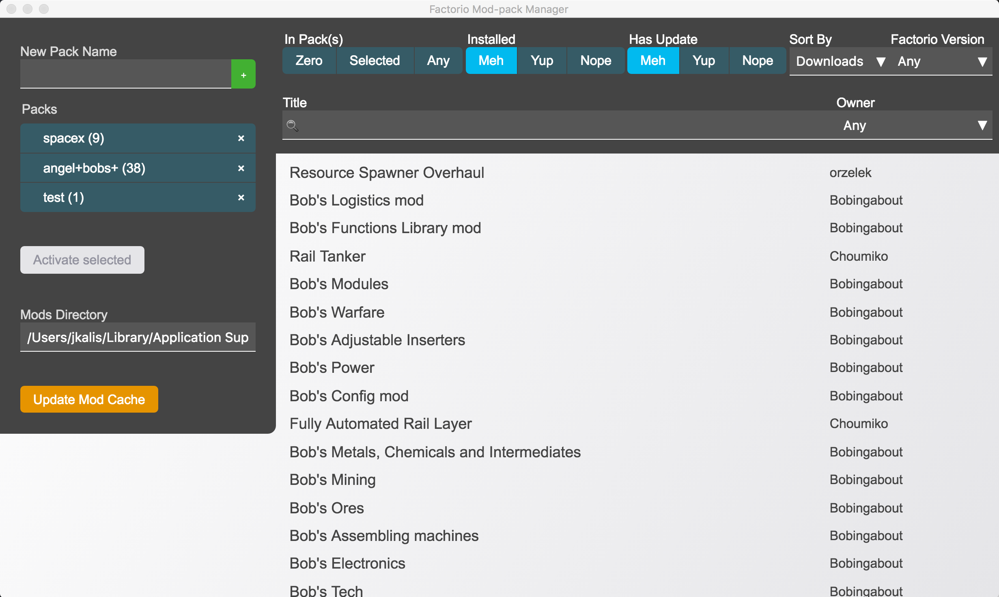

# factorio-mod-pack-manager

A way to manage groupings of (local) mods for various games of Factorio.

## Setup

  1. Clone or Fork this - [Mod Pack Manager] - repository
  2. `npm install` - install dependencies
      - Node SASS - for compiling CSS styling
      - Electron-prebuilt - for the base Electron application
      - Electron-packager - for bundling the app to distribute
  3. `npm start` - run the application

## TODO

  - [ ] Hide credentials inputs after successful download.
  - [ ] Always provide a "base" mod pack that is pure vanilla.
  - [ ] Import existing setup if it doesn't match a mod pack.
  - [ ] Bulk download of updated mods; after cache refresh.
  - [ ] Use IndexedDB for data storage; enable more complex querying?

[Mod Pack Manager]: https://github.com/kalisjoshua/factorio-mod-pack-manager
